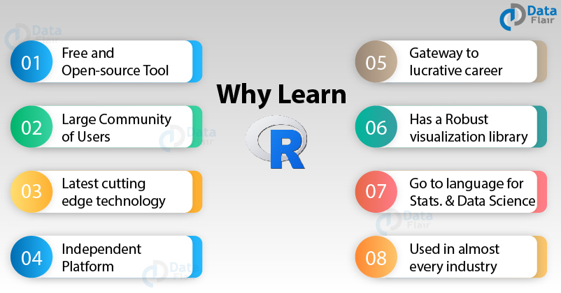

```{r setup, include=FALSE}
library(learnr)
tutorial_options(exercise.timelimit = 60)
```

## User requirements

- Laptop
- Internet connection.

## Objectives

- Understand what R programming is and how it operates
- Be able to install R and Rstudio on own laptops
- Understand what packages are, how to install and load them

## What is R programming language?

- R is an **open-source** programming language for statistical computing and graphics supported by the R Foundation for Statistical Computing.

- It is **object-oriented** i.e we create objects and manipulate them as intended

- It's **flexible**, **extensible** and **comprehensive** for productivity.

## Why learn R?

- As technology improves, data collected has become more and more complex (sometimes referred to big data), and R has been adopted by many as the language of choice to analyze data.




## Who uses R?

- Multiple companies and governments.

- R is used to manipulate data from different sectors e.g finance, research, Humanitarian, education e.t.c


## Installing R

1. Open an internet browser and go to **www.r-project.org**
2.  Under **Getting Started**, click the **download R** link in the middle of the page.
3.  Under **0-Cloud** click **https://cloud.r-project.org/**
4.  Under **Download and Install R**, click on the **Download R for Windows(for those using windows laptops)** / "Download R for (Mac) OS X" (for those using mac laptops) link .
5.  Click **Install R for the first time**.
6. Click on **Download R 4.1.0 for Windows** (for those using window laptops)
6.  Save the file, double-click it to open, and follow the installation instructions.
7.  Now that R is installed, you need to download and install RStudio.

## Installing Rstudio

**What is Rstudio**

- A user interface
- An intergrated development enviroment (IDE)

**Installing R studio**

1. Open an internet browser and go to **https://www.rstudio.com/products/rstudio/download/**.
2. Scroll down the page until you get to **All Installers** then click on **Windows 10 link (for window users)** and **macOS 10.13+ link(for mac users)**
2. Save the file on your computer, double-click it to open, and follow the installation instructions.

## RStudio interface


## Creating projects

- Organizing your work in projects makes it easier to locate your files and access them with ease.

- If someone doesn't organize their work into projects, locating the data files and scripts might become messy.

**How to create projects**

## R packages

**What are they?**

A package bundles together code, data, documentation, and tests, and is easy to share with others.

**Who develops them?**

Any R developer who wants to contribute to the open source community.

**How to install?**

- install.packages(”name of package”)

- Use the Rstudio interface i.e Packages ->install -> type name of package on popup -> install

**How to use them in R**

Load the package i.e library(name of package)

## R objects

**What is an object and how to create it**

## Some rules in R

- R is case-sensitive meaning that object "t" and object "T" are two different objects.

- R doesn't allow for special character and spaces in object name

